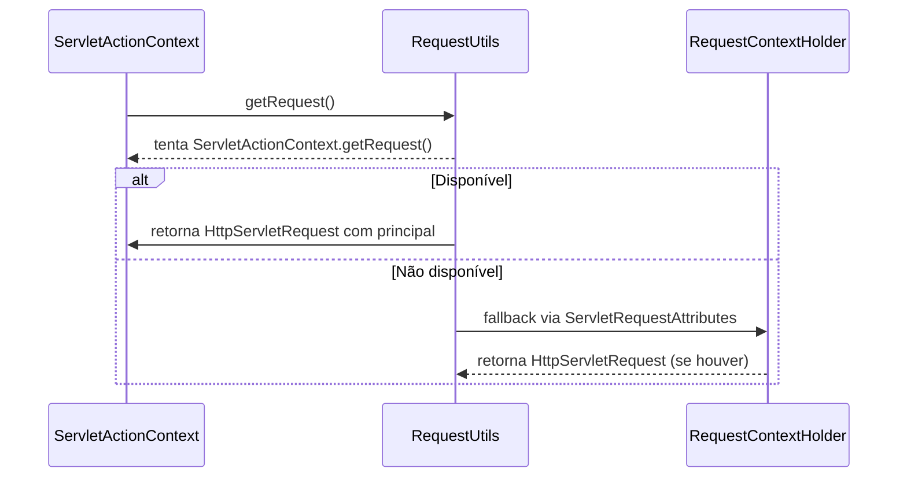
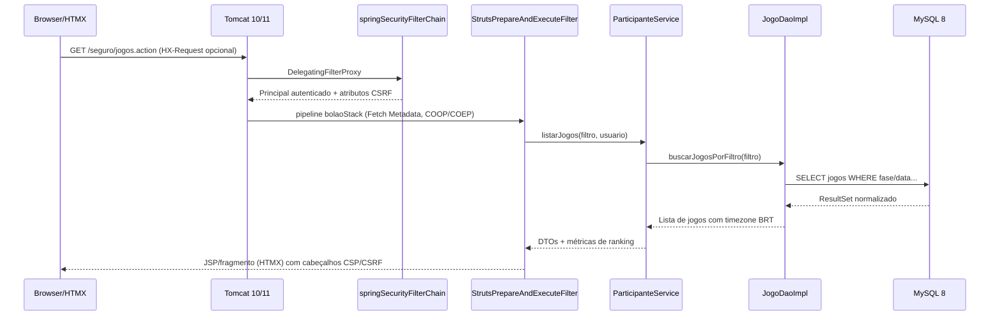
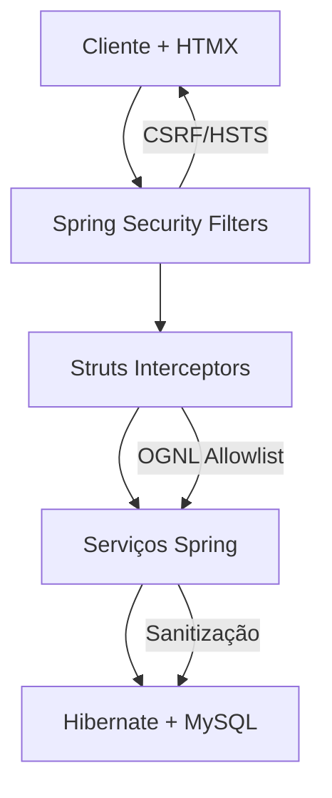
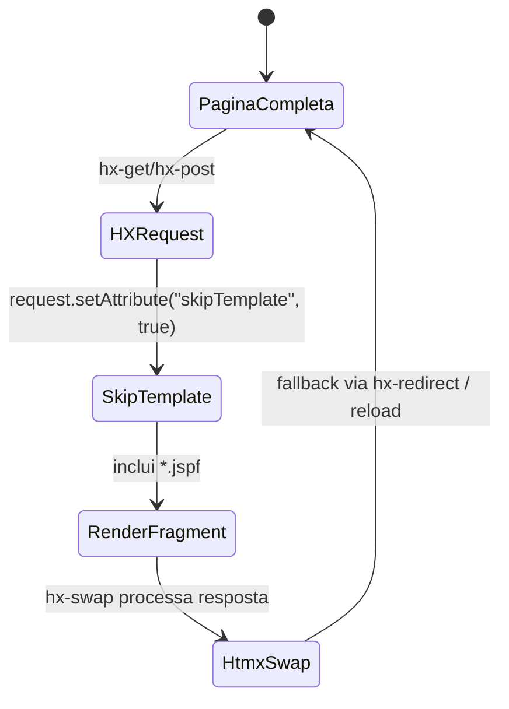
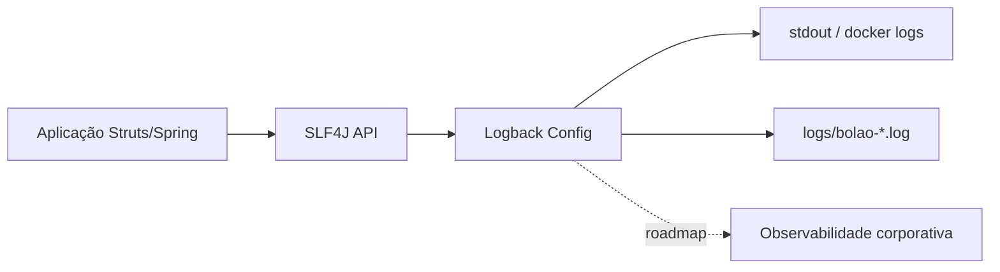
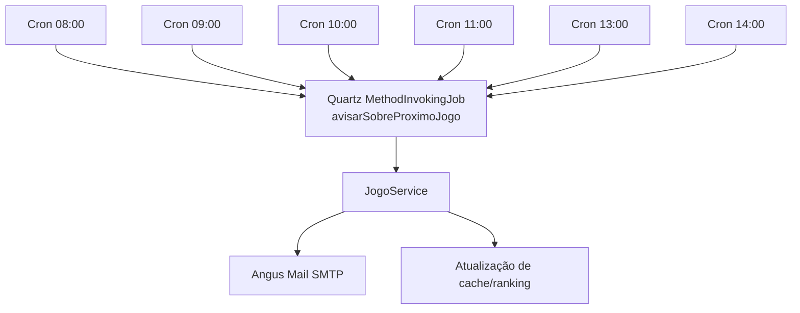
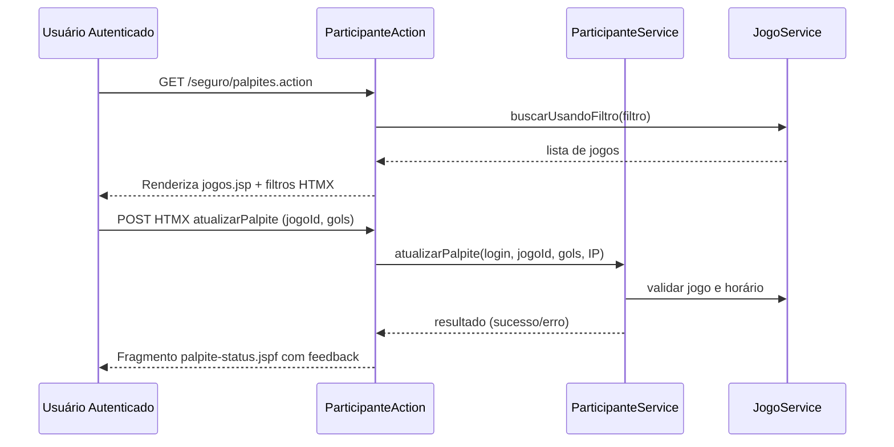
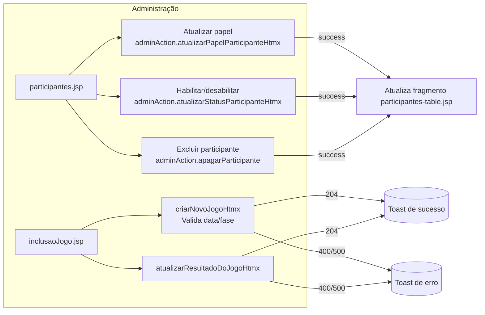
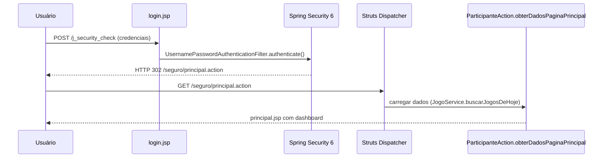

# README de Migração – Sistema Bolão

Documento executivo e técnico que consolida o estado da modernização do Sistema Bolão em **23/02/2026**. Voltado a stakeholders de negócio (organização do bolão Copa 2026), liderança técnica e Time Mercúrio (desenvolvimento, QA e operações).

---

## 1. Resumo Executivo
- **Objetivo do produto:** plataforma corporativa de bolão para a Copa do Mundo FIFA 2026, preservando fluxos clássicos (cadastro, palpites, ranking, gráficos) enquanto moderniza a stack Java 2006 para tecnologias suportadas em 2026.
- **Arquitetura atual:** monólito Java 17 empacotado em WAR, executando em Tomcat 10.1+/11 com Spring 6.1.14, Struts 7.1.1, Hibernate 6.4.4.Final e frontend JSP + HTMX empacotado via Vite.
- **Estado da modernização:** fases de segurança/back-end concluídas; frontend legado higienizado; pendências críticas concentram-se na remediação de CVEs (Angus Mail 2.0.3 e Quartz 2.3.2) e na finalização do dataset oficial da Copa 2026.
- **Situação operacional:** build Maven com testes JUnit 5 estável; pipeline Node/Vite funcional; container Docker (Tomcat + MySQL 8) validado com TLS self-signed; tarefas de documentação e segurança mantêm rastreabilidade no `passo-a-passo.md`.

---

## 2. Domínio e Jornadas de Usuário

### 2.1 Personas e Papéis
- **Participante (ROLE_USER):** se cadastra, registra palpites, acompanha ranking e gráficos pessoais.
- **Administrador (ROLE_ADMIN):** prepara tabela de jogos, atualiza resultados, gerencia papéis dos participantes, libera fases e monitora estatísticas.
- **Operações/Infra:** garante disponibilidade do ambiente Tomcat, execução dos agendamentos Quartz e entrega de notificações por e-mail (Angus Mail).
- **Analista de Produto:** acompanha métricas de engajamento e status da migração para planejar releases conforme calendário FIFA.

### 2.2 Fluxos Essenciais
1. **Onboarding:** cadastro público (`cadastro.jsp`) e ativação automática (com RBAC e sanitização Spring Security 6).  
2. **Registro de palpites:** participantes informam placares por jogo; bloqueio ocorre quando `Jogo.jaOcorreu()` retorna verdadeiro (respeitando horário BRT).  
3. **Ranking e dashboards:** serviços `ParticipanteService` e `RankingService` consolidam pontuação, alimentando gráficos (JFreeChart) e listas Struts.  
4. **Administração:** telas `/admin/*.action` permitem criar/julgar partidas, ajustar participantes e reexecutar cálculos; interações assíncronas usam HTMX + endpoints Struts; uploads utilizam `commons-fileupload2`.  
5. **Notificações e jobs:** Quartz agenda processos (ex.: lembretes de jogos, consolidação diária) e Angus Mail envia e-mails SMTP.  
   - **Configuração SMTP moderna:** via `EmailConfiguration` é possível sobrepor `mail.smtp.*` com arquivo externo (`bolao.email.config` ou variável `BOLAO_EMAIL_CONFIG`) e/ou variáveis de ambiente (`SMTP_HOST`, `SMTP_PORT`, `SMTP_USERNAME`, `SMTP_PASSWORD`, `SMTP_TLS`, `SMTP_SSL`, `SMTP_SSL_TRUST`).  
   - **Docker Compose:** o serviço `app` aceita as variáveis acima; ajustar `SMTP_AUTH=true` para habilitar autenticação e utilizar TLS (`SMTP_TLS=true`) ou SMTPS (`SMTP_SSL=true`) conforme o servidor corporativo.  
   - **Timeouts padrão:** `mail.smtp.connectiontimeout`, `mail.smtp.timeout` e `mail.smtp.writetimeout` ficam em 10s e podem ser sobrepostos sem rebuild.  
6. **Chat legacy:** recurso histórico foi desativado durante a migração; existe ADR para futura reimplementação com tecnologias modernas.

### 2.3 Regras de Pontuação
Implementadas em `Palpite#getPontuacao()`:
- **6 pontos** — palpite acerta placar exato (gols das duas equipes).  
- **3 pontos** — acerta resultado (vitória/empate) + número de gols de uma equipe (bônus).  
- **2 pontos** — acerta apenas o resultado (sem bônus).  
- **1 ponto** — acerta somente os gols de uma das equipes.  
- **0 pontos** — demais cenários.  
Os contadores (`DadosClassificacao`) alimentam rankings, gráficos temporais e estatísticas por categoria de acerto.

### 2.4 Dependências Externas de Negócio
- **Calendário FIFA 2026:** datas (11/06–19/07), sedes e formato ampliado (48 seleções, fases 32-avos → final).  
- **Repositório corporativo Maven (nx-mvn.tse.jus.br):** controla disponibilidade de versões seguras (Struts, Spring, Angus, Quartz).  
- **Infraestrutura de e-mail corporativa:** exige atualização de Angus Mail para 2.0.4 assim que liberada.

---

## 3. Contexto Copa do Mundo FIFA 2026 e Gestão de Dados

### 3.1 Formato do Torneio
- **Fase de grupos:** 12 grupos (A–L) com 4 seleções cada.  
- **Eliminatórias:** 32-avos, 16-avos, oitavas, quartas, semifinal, disputa de 3º lugar e final (total 104 partidas).  
- **Locais oficiais:** 16 cidades entre Canadá, México e EUA (configuradas em `web.xml`).  
- **Fuso horário de referência:** horário oficial de Brasília (BRT), com normalização automática no dataset.

### 3.2 Pipeline de Dados
1. **Fonte primária:** planilhas CSV normalizadas (`data/copa2026_tabela_brt_normalizado.csv`).  
2. **Transformação:** script `scripts/atualizar_copa2026_dataset.py` gera SQL (`data/sql/03-copa-2026-data.sql`) e CSV final, aplicando placeholders e ids sequenciais.  
3. **Carga:** executada via MySQL (`mysql --default-character-set=utf8mb4`) ou scripts de inicialização Docker (`docker/mysql/init`).  
4. **Placeholders:** `data/copa2026_placeholders.json` registra seleções pendentes (repescagens). O script substitui nome, grupo e slot assim que confirmados.  
5. **Assets de bandeiras:** `scripts/download_flags.py` e `download_missing_flags.py` garantem PNGs atualizados em `webapp/img/bandeiras/` (UTF-8).  
6. **Auditoria de dados:** logs dedicados (`.ia/logs/session-20260222-*.md`) descrevem cargas, validações SQL e smoke tests.

### 3.3 Pendências de Dados
- Atualização final do SQL após definição oficial dos playoffs.  
- Revisão das descrições das fases e horários definitivos fornecidos pela FIFA.  
- Inclusão de métricas adicionais (ocupação de estádios, público) caso aprovadas para fases futuras.

---

## 4. Arquitetura e Stack

### 4.1 Visão de Camadas
```
JSP/HTMX (UI) → Struts Actions → Serviços Spring → DAOs Hibernate → MySQL
                                  ↓
                             Quartz Jobs
                                  ↓
                              Angus Mail
```
- **UI:** JSP modularizados em `webapp/WEB-INF/content/` com fragments compartilhados (`cabecalho.jspf`, `rodape.jspf`).  
- **Actions Struts:** controlam roteamento `.action`, validam entrada (`@StrutsParameter`) e orquestram serviços.  
- **Serviços Spring:** implementados em `src/com/opendev/bolao/service/impl`, encapsulam regras de negócio e transações.  
- **Persistência:** Hibernate 6 usa mapeamentos XML (HBM) migrados para Jakarta (`jakarta.persistence`).  
- **Infra auxiliar:** Quartz agenda rotinas; Angus Mail envia notificações; Logback padroniza logs.

### 4.2 Módulos e Responsabilidades
| Módulo / Pacote | Responsabilidade | Notas |
|-----------------|------------------|-------|
| `com.opendev.bolao.action` | Actions Struts (participante, admin, relatórios) | Usa `@StrutsParameter` e interceptores HTMX |
| `com.opendev.bolao.service` | Lógica de negócio, cálculos de ranking, notificações | Métodos com segurança declarativa (Spring Security) |
| `com.opendev.bolao.dao` | Acesso a dados via Hibernate 6 | SessionFactory atualizada (`getCurrentSession()`) |
| `com.opendev.bolao.model` | Entidades de domínio (`Participante`, `Jogo`, `Palpite`) | Mantém HBM por compatibilidade |
| `src/frontend/` | Módulos JS (tooltips, telas HTMX) | Empacotamento Vite com manifest/fallback |
| `scripts/` | Automação de dados, auditoria (axe), download de assets | Rodar com Python 3.10+ |

### 4.3 Stack Tecnológica (Versões Chave)
| Camada | Versão | Observações |
|--------|--------|-------------|
| Java / Compiler | 17 | `maven.compiler.source/target` |
| Spring Framework | 6.1.14 | BOM importado no `pom.xml` |
| Spring Security | 6.2.2 | CSRF + HSTS/HPP |
| Struts | 7.1.1 | `commons-fileupload2` 2.0.0-M4 |
| Hibernate ORM | 6.4.4.Final | Compatível Jakarta EE 10 |
| Database | MySQL 8.0/8.3 driver | HikariCP 5.1.0 |
| Frontend | JSP + HTMX 1.9+, Vite 5 | Bundles com hash e fallback |
| Logging | SLF4J 2.0.12 + Logback 1.5.0 | Config custom em `logback.xml` |
| Testes | JUnit 5.10, Mockito 5.10, AssertJ 3.25 | Suites unitárias e mocks |

### 4.4 Integrações e Jobs
- **Quartz (`org.quartz-scheduler:quartz` 2.3.2):** roda notificações e tarefas de housekeeping; pendente upgrade para 2.5.2.  
- **Angus Mail 2.0.3:** envio SMTP (cadastro, lembretes); aguardando 2.0.4 no repositório interno.  
- **Vite/Node:** `frontend-maven-plugin` instala Node 20.11.1 em builds Maven completos.  
- **Scripts Python:** dependem de `pandas`/`python-dateutil` conforme requirements privados (ver comentários em scripts).  
- **Dependency-Check:** plugin OWASP 12.1.0 configurado com `failBuildOnCVSS=7` e dataDir local.

### 4.5 Topologia de Deploy
- **Runtime padrão:** Tomcat 10.1 (Docker distroless custom) com TLS (keystore auto-gerado).  
- **Portas:** 8080 (HTTP) e 8443 (HTTPS).  
- **Secrets:** injetados via variáveis (`DB_HOST`, `DB_USER`, `DB_PASS`) ou `applicationContext-resources.xml` parametrizado.  
- **Docker Compose:** orquestra `app` (Tomcat) e `db` (MySQL 8) com health checks e volume persistente (`db_data`).  
- **CI/Build offline:** `frontend.skip=true` permite builds sem Node; fallback `webapp/assets/js/app-bundle.js` mantido atualizado.

### 4.6 Propagação do Principal em requisições HTMX (03/03/2026)
Para estabilizar os fluxos HTMX que dependem de `HttpServletRequest#getUserPrincipal()`, executamos uma correção arquitetural envolvendo filtro adicional, utilitário de request e documentação correlata.

#### 4.6.1 Pipeline de filtros após o ajuste
```mermaid
flowchart LR
    A[Cliente HTMX] --> B[StrutsPrepareAndExecuteFilter]
    B --> C[springSecurityFilterChain]
    C --> D[RequestContextFilter<br/>(novo)]
    D --> E[ServletActionContext<br/>/ Struts Action]
    E --> F[ParticipanteAction.prepararConteudoPalpite]
```
- **`org.springframework.web.filter.RequestContextFilter`:** adicionado imediatamente depois do `DelegatingFilterProxy` (`springSecurityFilterChain`) no `web.xml`. Ele garante que o `RequestContextHolder` utilize o wrapper provido pelo Spring Security, expondo o principal autenticado para as Actions Struts.
- **Efeito prático:** chamadas HTMX (`HX-Request=true`) agora recebem `HttpServletRequest#getUserPrincipal()` populado, eliminando a necessidade de depender somente do `SecurityContextHolder`.

#### 4.6.2 Evolução do `RequestUtils.getRequest()`

- Código agora prioriza `ServletActionContext.getRequest()` (quando Struts já está ativo) e mantém fallback para o `RequestContextHolder`.
- Inclusão de log dedicado: `[SEC][HTMX] principal recuperado via HttpServletRequest name={usuario}` permite auditar a origem do principal durante o diagnóstico de chamadas HTMX.
- O fallback via `SecurityContextHolder` permanece disponível apenas como contingência para cenários não Struts.

#### 4.6.3 Rastreamento e governança
- **Passo-a-passo atualizado:** a etapa “Validar contexto de segurança” foi marcada como concluída, liberando o foco para a revisão de timezone/autorizações (próxima etapa do plano).
- **Plano dedicado (`.ia/planos/plano-correcao-palpites-popup.md`):** registra a conclusão da etapa 2 com as evidências do novo filtro e orienta a avançar para as próximas subtarefas (CSP, UX, automação).
- **Log de sessão `.ia/logs/session-20260303-filtros-principal.md`:** documenta comandos executados (`mvn`, `docker compose`, `curl` ROLE_USER/ROLE_ADMIN) e os trechos de log que comprovam a recuperação do principal via `HttpServletRequest`.

> **Verificação rápida:** execute `docker compose build app && docker compose up -d app`, autentique-se com `curl` usando cookies e chame `/seguro/palpiteFormPartial.action` com o header `HX-Request=true`. O log da aplicação deve exibir o marcador `[SEC][HTMX] principal recuperado via HttpServletRequest name=<usuário>`.

### 4.7 Componentes internos e dependências
- **Ações Struts 7:** orquestram regras de negócio e delegam para os serviços Spring. (`ParticipanteAction`, `AdminAction`).
- **Serviços Spring 6:** encapsulam cálculos de ranking, regras de bloqueio de palpites e notificações. (`ParticipanteService`, `JogoService`).
- **Camada de segurança:** filtros Spring Security (`springSecurityFilterChain`), interceptores Struts (`bolaoStack`) e utilitários (`RequestUtils`).
- **Persistência Hibernate 6:** DAOs convertem requisições em HQL/Criteria e usam `SessionFactory.getCurrentSession()`.
- **Infraestruturas assistentes:** Quartz agenda avisos de jogos; Angus Mail envia notificações; HTMX/Vite alimentam interações assíncronas documentadas em `.ia/logs/session-20260303-filtros-principal.md` e planos correlatos.

```mermaid
flowchart LR
    subgraph UI
        Browser[Browser/HTMX]
        JSP[JSP + Fragments]
        Bundler[Vite Bundles]
    end
    subgraph Struts7[Struts 7]
        Interceptors[Interceptor stack bolaoStack]
        Actions[Actions (Participante/Admin)]
    end
    subgraph Spring6[Spring 6]
        Services[Serviços]
        Security[Spring Security 6 filtros]
    end
    subgraph Persistence[Persistência]
        DAOs[DAOs Hibernate 6]
        MySQL[(MySQL 8)]
    end
    subgraph Infra
        Quartz[Quartz Schedulers]
        Angus[Angus Mail]
        Logs[SLF4J/Logback]
    end

    Browser --> JSP
    Bundler --> JSP
    JSP --> Interceptors --> Actions
    Actions --> Services --> DAOs --> MySQL
    Services --> Quartz
    Services --> Angus
    Services --> Logs
    Interceptors --> Security
    Security --> Services
```

### 4.8 Fluxo de requisição end-to-end (público x autenticado)
O fluxo abaixo resume o caminho de uma chamada `GET /seguro/jogos.action` (área autenticada) e evidencia a pilha de filtros configurada em `web.xml`.



> **Diagnóstico:** Em cenários públicos (`/login.action`), o Struts continua no fluxo porém a autenticação retorna 302 para `/seguro/principal.action` ou `403` conforme regras do Spring Security 6 (`DefaultAccessDeniedHandler`).

### 4.9 Segurança multicamadas
A arquitetura de defesa distribui responsabilidades do navegador até o banco. A tabela consolida os controles ativos e suas referências para auditoria.

| Camada | Controles | Evidências |
|--------|-----------|------------|
| Browser / Cliente | HTTPS obrigatório, HSTS parcial, tokens CSRF propagados via meta tags e `<input>` global | `.ia/logs/session-20260219-validacao-login-https.md`, `.ia/logs/session-20260219-remocao-sha1.md` |
| Filtros Servlet | `springSecurityFilterChain`, `RequestContextFilter`, bloqueio de favicon 403, cabeçalhos CSP/COOP/COEP | `.ia/logs/session-20260303-filtros-principal.md`, `.ia/logs/session-20260222-login-403-favicon.md` |
| Struts 7 Interceptors | Fetch Metadata, sanitização OGNL, `@StrutsParameter` | `.ia/logs/session-20260219-struts-ognl-hardening.md`, `.ia/logs/session-20260219-struts-parameter-hardening.md` |
| Camada de Serviço | Segurança declarativa (Spring Security annotations), validações de horário/entrada, sanitização | `.ia/logs/session-20260303-requestutils-seguranca.md`, `.ia/logs/session-20260226-correcao-palpites.md` |
| Persistência | Hibernate 6 com parâmetros nomeados, bloqueio de SQL dinâmico, auditoria de queries críticas | `.ia/logs/session-20260219-correcao-jogos-ocorridos.md`, `.ia/logs/session-20260221-auditoria-segredos.md` |



### 4.10 Arquitetura HTMX e renderização parcial
- `cabecalho.jspf` avalia `skipTemplate` para controlar se a resposta envia `<html>` completo ou apenas fragmentos (`*.jspf`).
- Interceptor `HtmxDebugInterceptor` registra `[HTMX-TRACE]` e enriquece logs com headers `HX-*`.
- `ParticipanteAction`/`AdminAction` separam métodos `*Htmx` e métodos de página completa, mantendo coesão de templates.
- Bundler Vite gera assets modulares (`manifest.json`), enquanto `app-bundle.js` garante fallback offline.
- Releases promovidas (ex.: 0.2.11) executam `npm run build`/`mvn clean package -Dfrontend.skip=false`, produzindo um bundle hashado (`main-C50fFhNb.js`) e atualizando o manifest consumido pelo loader JSP.



> **Boas práticas:** Logs `[HTMX][PREP]` e `[HTMX][UPDATE]` indicam preparação/commit de palpites; revisar `.ia/logs/session-20260303-palpites-inline-instrumentacao.md` quando depurando diferenças entre fragmentos e páginas completas.

#### 4.10.1 Artefatos Vite por release
- **Pipeline determinístico:** cada versão executa `npm install` → `npm run build` → `mvn clean package -Dfrontend.skip=false`, atualizando `webapp/assets/.vite/manifest.json` e gerando `main-<hash>.js`. Na release 0.2.11, o hash publicado foi `main-C50fFhNb.js`.
- **Manifest + fallback:** o loader em `cabecalho.jspf` tenta resolver o bundle via manifest; caso o arquivo não exista (build frontend pulado), ele carrega `app-bundle.js`, mantendo a aplicação funcional.
- **Publicação Docker:** `docker compose build app` copia o WAR com manifest e bundles para a imagem `novobolao-app`, garantindo que o runtime sirva os mesmos artefatos validados nos testes.
- **Recuperação rápida:** hashes anteriores permanecem versionados; basta recriar o build frontend para gerar um novo hash e o loader passará a referenciá-lo sem alterações no JSP.

```mermaid
flowchart LR
    subgraph Build
        A[npm run build] --> B[Vite 5<br/>gera main-<hash>.js]
        B --> C[manifest.json]
        B --> D[app-bundle.js (fallback)]
        C --> E[mvn clean package<br/>-Dfrontend.skip=false]
    end

    E --> F[WAR 0.2.11]
    F --> G[docker compose build app]
    G --> H[Imagem novobolao-app]
    H --> I[Tomcat 10/11]
    I --> J[cabecalho.jspf]
    J -- manifest ok --> K[Carrega main-<hash>.js]
    J -- manifest ausente --> L[Carrega app-bundle.js]
    K --> M[Navegador]
    L --> M
```

### 4.11 Observabilidade e logging
- **Trilha principal:** SLF4J → Logback (`logback.xml`) com appenders console/arquivo; marker `[SEC]` diferencia eventos sensíveis.
- **HTMX:** `HtmxDebugInterceptor` e ações registram `[HTMX-TRACE]`, `[HTMX][PREP]`, `[HTMX][UPDATE]` para correlação em incidentes.
- **Serviços críticos:** `ParticipanteService` e `JogoService` emitem métricas de execução e IDs de jogo/usuário em INFO.
- **Pendências:** integração com agregador corporativo (Elastic/Stackdriver) e métricas Prometheus (ver `passo-a-passo.md` Tarefa 18 placeholder).



> **Próximos passos sugeridos:** abrir subtarefa para instrumentar MDC (`requestId`, `hx-request`) e avaliar integração com a stack corporativa de observabilidade ao concretizar o plano `.ia/planos/plano-testes-infra.md`.

### 4.12 Jobs Quartz e processos assíncronos
`applicationContext-scheduler.xml` agrupa o job `avisarSobreProximoJogo` com múltiplos gatilhos Cron (08h–14h BRT, dias úteis). O método `JogoService.avisarSobreProximoJogo()` compõe as notificações e delega o envio ao `EmailService` (Angus Mail 2.0.3).



> **Upgrade planejado:** assim que o mirror corporativo disponibilizar Quartz 2.5.2 e Angus 2.0.4, revalidar compatibilidade (registrado em `.ia/historico/ADR-20260223-aguardar-angus-quartz.md`).

### 4.13 Configuração e deployment
A tabela resume variáveis críticas e suas origens. Sempre utilizar secrets externos em produção.

| Parâmetro | Origem recomendada | Default atual | Impacto |
|-----------|--------------------|---------------|---------|
| `DB_HOST`, `DB_PORT`, `DB_NAME` | Variáveis Docker / `applicationContext-resources.xml` | `db`, `3306`, `bolao` | Conexão MySQL utilizada por Hibernate |
| `DB_USER`, `DB_PASS` | Variáveis de ambiente ou secrets manager | `bolao`, `bolao` (docker compose local) | Credenciais aplicadas ao `HikariDataSource` |
| `SPRING_PROFILES_ACTIVE` | Variável JVM | `default` | Seleciona configs específicas (futuro) |
| `SMTP_*` (`HOST`, `PORT`, `TLS`, `SSL`, `USERNAME`, `PASSWORD`) | `.env`/secret externo + `EmailConfiguration` | Não definido (obrigatório quando envio ativo) | Envio de notificações via Angus Mail |
| `SMTP_FROM_ADDRESS`, `SMTP_FROM_NAME` | `.env`/arquivo externo | `bolao@localhost`, `Bolão Corporativo` | Apresentação do remetente nos e-mails |
| `BOLAO_EMAIL_CONFIG` / `bolao.email.config` | System property | vazio | Sobrescreve todos os parâmetros SMTP por arquivo |
| `BOLAO_CSP_REPORT_ONLY` | Variável ambiente | `true` | Controla modo report-only da CSP atual |
| `LOG_LEVEL_ROOT` | Variável Docker | `INFO` | Ajusta níveis Logback em runtime |
| `JAVA_TOOL_OPTIONS` | Variável Docker | `-XX:+UseContainerSupport` | Ajustes de memória/container |

> **Checkpoints:** revisar `.ia/documentacao/README-migracao-2026-v1.md` para exemplos práticos de `.env` e propriedades externas. No build Maven, os parâmetros podem ser passados via `-D` para smoke tests.

### 4.14 Roadmap arquitetural (2026-03)
1. **CSP rígida sem `'unsafe-inline'`:** depende da conclusão do plano `.ia/planos/plano-bundler-frontend.md` (Passo 4 – remover inline legacy).
2. **Observabilidade corporativa:** abrir tarefa derivada no `passo-a-passo.md` vinculada ao plano `.ia/planos/plano-testes-infra.md` para enviar logs a Stackdriver/ELK.
3. **Quartz 2.5.2 + Angus 2.0.4:** acompanhar mirror corporativo e repetir `mvn dependency-check` para encerrar CVEs abertas (ver Tarefa 15 “Remediação Dependency-Check”).
4. **HTMX + CSP enforcement:** continuar migração de balões de palpite conforme `.ia/planos/plano-correcao-palpites-popup.md` (Etapa 3 – CSP e UX).
5. **Auditoria Axe + WCAG 2.1:** desbloquear infraestrutura Chrome headless e registrar evidências em `.ia/logs/` (Tarefa 7 Fase 2.5 reaberta).

---

## 5. Experiência de Desenvolvimento

### 5.1 Pré-requisitos
- **Java/Maven:** JDK 17+, Maven 3.9+.  
- **Node/npm:** Node.js 20.11.1 e npm 10+ (ou permitir que o `frontend-maven-plugin` faça o download isolado).  
- **Bundler:** Vite 5 (instalado via `npm install`).  
- Python 3.10+ (scripts de dados).  
- Docker/Docker Compose opcionais para testes integrados.  
- Acesso ao repositório Maven corporativo (`nx-mvn.tse.jus.br`) configurado em `~/.m2/settings.xml`.
- **Configuração de Ambiente:** Arquivo `.env` na raiz (baseado no `.env.example`).

### 5.2 Setup Rápido
```bash
npm install                    # instala dependências front
npm run build                  # gera manifest Vite
mvn -Dfrontend.skip=true test  # build rápido com testes Java
mvn package -Dfrontend.skip=false  # build completo (Node + tests)
```
> **Dica:** use o modo `-Dfrontend.skip=false` antes de qualquer deploy para garantir que o manifest Vite e os bundles hashados estejam alinhados com o WAR gerado. Esse modo executa automaticamente `npm install`/`npm run build` dentro do Maven, evitando divergência entre os assets e o backend Struts/Tomcat.

### 5.3 Frontend e Bundler
- Código-fonte em `src/frontend/` (ES Modules).  
- Vite emite bundles com hash + fallback (`webapp/assets/js/app-bundle.js`).  
- `webapp/template/cabecalho.jspf` consulta `manifest.json`; fallback acionado se o manifest não existir.  
- Interações assíncronas usam HTMX (`hx-get`, `hx-post`) com headers CSRF centralizados em script utilitário.  
- Diretrizes de CSS/HTML em `.ia/diretrizes/frontend.md`; evitar inline script/style (preparação para CSP rígida).

#### Por que o npm é obrigatório?
- O frontend foi migrado para módulos ES e HTMX, empacotados via **Vite**, que roda sobre Node/npm.  
- Cada build gera `manifest.json` com nomes hashados (`main-XYZ.js`); sem esse passo o fallback `app-bundle.js` continua válido, porém sem as otimizações nem os polyfills configurados.  
- O Maven invoca o `frontend-maven-plugin` para instalar Node 20.11.1 isoladamente quando executado com `-Dfrontend.skip=false`, garantindo reprodutibilidade em ambientes que não têm Node pré-instalado.  
- As tasks `npm install` e `npm run build` também atualizam os assets compartilhados (`webapp/assets/.vite/`), necessários para o Tomcat servir o bundle correto em produção e para que o cache busting funcione.

### 5.4 Testes e Qualidade
- **JUnit/Mockito:** `mvn -q -Dfrontend.skip=true test`.  
- **Dependency-Check:** `mvn -Dfrontend.skip=true org.owasp:dependency-check-maven:check`.  
- **A11y (pendente de ambiente):** `scripts/run-axe-audit.sh` requer Chrome headless externo.  
- **Secret scan:** `scripts/scan-secrets.sh` (usa `rg`).  
- **Smoke manual:** `docker compose up -d app db` + validações via navegador ou `curl -k https://localhost:8443/login.jsp`.

### 5.5 Boas Práticas
- Consultar `.ia/diretrizes/` antes de propor alterações.  
- Criar ADR em `.ia/historico/` para decisões arquiteturais não triviais; promover para `docs/adr/` após aprovação.  
- Vincular commits às tarefas do `passo-a-passo.md` e atualizar logs em `.ia/logs/`.  
- Manter dataset FIFA sincronizado e documentar cada carga (logs específicos).  
- Respeitar instruções de segurança (sem reintroduzir DWR, Prototype, script inline).

---

## 6. Operação e Observabilidade

### 6.1 Configuração de Ambiente
- Variáveis obrigatórias: `MYSQL_ROOT_PASSWORD`, `MYSQL_PASSWORD`, `DB_HOST`, `DB_USER`, `DB_PASS`.  
- `applicationContext-resources.xml` suporta leitura via variáveis (sem credenciais hardcoded).  
- `logback.xml` define appenders rotativos (arquivo e console); ajustar níveis conforme ambiente.  
- Para produção, substituir o keystore auto-gerado por certificado oficial e configurar HSTS em modo pleno.

### 6.2 Deploy via Docker
```bash
docker compose build app
docker compose up -d app db
docker compose logs -f app   # acompanhar startup
```
- Health check do app usa `curl http://localhost:8080/`; DB usa `mysqladmin ping`.  
- Volumes (`db_data`) preservam estado do MySQL; para reset completo usar `docker compose down -v`.  
- Configuração HTTPS reside em `/usr/local/tomcat/conf/server.xml` (ver Dockerfile).

### 6.3 Monitoramento e Logs
- Logs de aplicação: `target/logs/` no build local ou `docker compose logs app`.  
- Quartz registra execuções em `logs/bolao-scheduler.log` (configurable).  
- Recomenda-se integrar com observabilidade corporativa (Stackdriver/ELK) ao mover para produção.

### 6.4 Troubleshooting Comum
- **Falha em Dependency-Check:** confirmar que mirror corporativo disponibiliza versões seguras (Angus 2.0.4, Quartz 2.5.2).  
- **Erro 403 após login:** verificar interceptor Spring Security para `/favicon.ico` (ajustado em 22/02).  
- **Manifest ausente:** rodar `npm run build` ou garantir fallback `app-bundle.js`.  
- **Datasets inconsistentes:** reexecutar script Python com `--placeholders` atualizados e aplicar SQL.

---

## 7. Postura de Segurança
- **Transporte:** HTTPS habilitado com HSTS (`max-age=31536000`), `X-Frame-Options SAMEORIGIN`, `Referrer-Policy strict-origin-when-cross-origin`.  
- **Proteção de sessão:** Spring Security 6 com `migrateSession`, logout POST, `CookieCsrfTokenRepository`.  
- **CSP:** `default-src 'self'; script/style 'self' 'unsafe-inline'; img/font data:` — plano para remover `'unsafe-inline'` após migração total para bundles.  
- **Struts Hardening:** `@StrutsParameter`, allowlist OGNL, limites de expressão configurados, JSPs dentro de `WEB-INF/`.  
- **Sanitização:** `SanitizationUtils` aplicado a entrada crítica; validações por campo nas Actions e camada de serviço.  
- **Segredos:** lidos de variáveis de ambiente ou arquivos externos; `scan-secrets.sh` auxilia auditorias.  
- **Dependências:** monitoramento contínuo pelo OWASP Dependency-Check; CVEs abertos em Angus/Quartz registrados em `.ia/historico/ADR-20260223-aguardar-angus-quartz.md`.  
- **Próximos passos de segurança:** endurecer CSP, concluir upgrades Angus/Quartz, retomar auditoria Axe e testes cross-browser.

---

## 8. Riscos e Pendências (23/02/2026)
| Prioridade | Item | Impacto | Mitigação / Responsável |
|------------|------|---------|-------------------------|
| Alta | CVEs Angus Mail 2.0.3 / Activation 2.0.2 | Bloqueia aprovação do Dependency-Check; risco em SMTP | Aguardar 2.0.4 no mirror; Time Mercúrio monitorando |
| Alta | CVEs Quartz 2.3.2 | Jobs críticos com exposição a vulnerabilidades elevadas | Monitorar 2.5.2 no mirror; repetir upgrade assim que liberado |
| Média | Auditoria Axe + cross-browser | Conformidade WCAG e navegadores alvo pendente | Provisionar ambiente com Chrome headless; reabrir tarefas 7/8 fase 2.5 |
| Média | Dataset final playoffs | Atualização de dados oficiais pode impactar relatórios | Sincronizar com calendário FIFA; registrar cargas e validar smoke |
| Baixa | CSP rígida | Segurança adicional contra XSS depende de eliminar inline | Continuar migração de scripts e atualizar cabeçalhos gradualmente |

---

## 9. Roadmap e Próximas Ações
1. **Tarefa 15 – Remediação Dependency-Check:** concluir upgrades Angus/Quartz e repetir varredura OWASP.  
2. **Tarefa 16 – Evolução do README:** complementar seções (negócio, arquitetura, operação) e manter documento vivo conforme migrações subsequentes.  
3. **Dados Copa 2026:** atualizar SQL final quando playoffs forem publicados e registrar evidências.  
4. **Auditoria de segurança e acessibilidade:** executar `run-axe-audit.sh` e testes cross-browser assim que infraestrutura permitir.  
5. **Endurecimento CSP e observabilidade:** revisar `logback.xml`, integrar com monitoramento corporativo e remover `'unsafe-inline'`.

---

## 10. Referências e Rastreabilidade
- **Planos:** `passo-a-passo.md` (Tarefas 14–16), `.ia/planos/plano-readme-migracao.md`, `.ia/planos/plano-evolucao-readme-migracao-2026.md`.  
- **Diretrizes:** `.ia/diretrizes/arquitetura.md`, `.ia/diretrizes/frontend.md`, `.ia/diretrizes/seguranca.md`.  
- **ADRs relevantes:** `ADR-20260217-upgrade-spring-framework.md`, `ADR-20260219-upgrade-struts-7.md`, `ADR-20260220-arquitetura-monolito-manter.md`, `ADR-20260219-jquery-remocao-gradual.md`, `ADR-20260223-aguardar-angus-quartz.md`.  
- **Logs chave (fev/2026):** ver diretório `.ia/logs/` para upgrades de dependências, dataset Copa 2026, bundler Vite e validações de segurança.  
- **Documentos auxiliares:** `README.md` (análise legado), `analise-inicial.md`, `.ia/documentacao/README-migracao-2026-v1.md` (versão anterior focada em segurança).

---

## 11. Histórico do Documento
| Data | Responsável | Alteração |
|------|-------------|-----------|
| 23/02/2026 | Assistente Técnico Líder (IA) | Criação do README consolidado conforme Tarefa 14 (versão base). |
| 23/02/2026 | Assistente Técnico Líder (IA) | Reestruturação completa alinhada à Tarefa 16, incluindo seção de jornada de negócio, arquitetura detalhada, operação, segurança e guia expandido para desenvolvedores. |
### 2.2.1 Configuração de E-mail
- **Arquivos padrão:** `src/main/resources/com/opendev/bolao/email/email.properties` (e réplica para compatibilidade) contêm defaults comentados.  
- **Externalização:**  
  1. **Arquivo externo:** defina o caminho via variável `BOLAO_EMAIL_CONFIG` ou system property `bolao.email.config`.  
  2. **Variáveis de ambiente:** `SMTP_HOST`, `SMTP_PORT`, `SMTP_AUTH`, `SMTP_USERNAME`, `SMTP_PASSWORD`, `SMTP_TLS`, `SMTP_STARTTLS_REQUIRED`, `SMTP_SSL`, `SMTP_SSL_TRUST`, `SMTP_CONNECTION_TIMEOUT`, `SMTP_TIMEOUT`, `SMTP_WRITE_TIMEOUT`, `SMTP_FROM_ADDRESS`, `SMTP_FROM_NAME`, `SMTP_SYSTEM_URL`.  
  3. **System properties:** qualquer `mail.smtp.*` também pode ser passado em `JAVA_OPTS`.  
- **Exemplos práticos:**  
  - *Arquivo externo (`/etc/bolao/email.properties`):*  
    ```properties
    mail.smtp.host = smtp.corporativo.intra
    mail.smtp.port = 587
    mail.smtp.auth = true
    mail.smtp.auth.user = bolao@app
    mail.smtp.auth.password = ********
    mail.smtp.starttls.enable = true
    mail.smtp.connectiontimeout = 10000
    mail.smtp.timeout = 10000
    mail.from.address = bolao@app
    mail.from.name = Bolão Corporativo
    ```  
  - *Variáveis em `.env` (lidas pelo `docker-compose`):*  
    ```env
    SMTP_HOST=smtp.corporativo.intra
    SMTP_PORT=465
    SMTP_SSL=true
    SMTP_SSL_TRUST=*
    SMTP_AUTH=true
    SMTP_USERNAME=bolao@app
    SMTP_PASSWORD=********
    SMTP_FROM_ADDRESS=bolao@app
    SMTP_FROM_NAME="Bolão 2026"
    ```  
- **Autenticação/TLS:** habilite `SMTP_AUTH=true` e informe usuário/senha; use STARTTLS (`SMTP_TLS=true`) para porta 587 ou `SMTP_SSL=true` para SMTPS (porta 465).  
- **Timeouts:** valores padrão 10 s (conexão/leitura/escrita); ajuste conforme necessidade.  
- **Boas práticas:** nunca versionar credenciais reais; utilize secrets manager ou `.env` local ignorado.

### 2.2.2 Fluxos das Telas e Regras Operacionais
Os fluxos abaixo cobrem a navegação principal e as regras aplicadas a cada contexto (público, área autenticada e administração).

#### Visão Geral da Navegação
```mermaid
flowchart TD
    Visitante([Visitante]) --> Index[index.jsp<br/>Router inicial]
    Index -->|Não autenticado| Login[login.jsp<br/>Formulário Spring Security]
    Index -->|Consultar regras| Regras[regras.jsp<br/>Regras do Bolão]
    Login -->|Quero me cadastrar| Cadastro[cadastro.jsp<br/>Validações: login único, senha 8-64, sanitização]
    Login -->|Ver regras| Regras
    Cadastro -->|Pedido enviado| Login
    Login -->|Credenciais válidas| AuthSpring[(Spring Security)]
    AuthSpring --> DecidirPerfil{Perfil da sessão}
    DecidirPerfil -->|ROLE_USER| Principal[/seguro/principal.action<br/>Dashboard de jogos e ranking]
    DecidirPerfil -->|ROLE_ADMIN| AdminPortal[/admin/participantes.action<br/>Gestão de usuários]
    Principal --> Palpites[/seguro/palpites.action<br/>HTMX + bloqueios por horário]
    Principal --> Ranking[/seguro/ranking.action]
    Principal --> TrocaSenha[/seguro/trocaSenha.action]
    Principal --> Regras
    AdminPortal --> AdminJogos[/admin/infoEquipes.action<br/>CRUD de partidas]
    AdminPortal --> AdminParticipantes[/admin/participantes.action<br/>RBAC, habilitação, exclusão]
    AdminPortal --> Logout[logout.action]
    Logout --> Login
```

#### Regras por Área
- **Público (não autenticado)**  
  - `login.jsp`: formulário com CSRF, feedback centralizado; redireciona conforme papéis concedidos.  
  - `cadastro.jsp`: sanitização em todos os campos, senha 8–64 caracteres com símbolos seguros, verificação de login único no serviço.  
  - `index.jsp`: atua como roteador – direciona usuários autenticados para `/seguro/principal.action` e visitantes para `login.action`.
  - `regras.jsp`: compila pontuação, prazos e critérios de desempate do bolão; acessível via menu “Regras” ou diretamente em `/regras.action`.

- **Área Segura (`/seguro`)**  
  - `principal.jsp`: exibe jogos do dia, gráfico de liderança e mensagens de status; jogos sem resultado exibem placeholders.  
  - `jogos.jsp`: filtros por data, fase, grupo e equipe; HTMX para abrir modal de palpites; bloqueia atualização se `Jogo.jaOcorreu()` for verdadeiro.  
  - `classificacao.jsp`: ordenação por pontuação total com tie-break por nome (`Participante.getNomeFormatado()`); destaca o usuário autenticado na grade.  
  - `graficoDesempenho.jsp`: exige rival válido; gera série temporal cumulativa com JFreeChart.  
  - `trocaSenha.jsp`: valida senha atual, aplica `BCrypt` e regras de complexidade antes de persistir.

- **Administração (`/admin`)**  
  - `participantes.jsp`: apenas `ROLE_ADMIN`; lista usuários com filtros de status; ações de habilitar, mudar papel e excluir usam HTMX retornando fragmentos.  
  - `inclusaoJogo.jsp`: cria partidas informando data, hora, fase, equipes e local; validações impedem partidas com equipes duplicadas.  
  - `jogos.jsp`: admins podem atualizar placar final; serviço rejeita valores negativos e jogos inexistentes.  
  - Operações HTMX de participantes respondem com `participantes-rows.jspf` (HTTP 200); endpoints de jogos retornam 204/400/500 conforme a validação no `AdminAction`.

#### Diagrama – Ciclo de Palpites


#### Diagrama – Operações Administrativas


#### Fluxo de Autenticação e Redirecionamento


#### Referência Rápida das Ações Administrativas
| Ação | Endpoint | Método Struts | Validações chave | Resposta |
|------|----------|---------------|------------------|----------|
| Atualizar papel | `POST /admin/atualizarPapelParticipante.action` | `AdminAction#atualizarPapelParticipanteHtmx` | Sanitiza `papel` (32 chars) e aplica RBAC (`ROLE_ADMIN`) | 200 + fragmento `participantes-rows.jspf` |
| Alterar status | `POST /admin/atualizarStatusParticipante.action` | `AdminAction#atualizarStatusParticipanteHtmx` | Sanitiza `status` (16 chars) e converte para booleano | 200 + fragmento `participantes-rows.jspf` |
| Remover participante | `POST /admin/apagarParticipanteHtmx.action` | `AdminAction#apagarParticipante` | Exclui registro e recarrega lista | 200 + fragmento `participantes-rows.jspf` |
| Criar jogo | `POST /admin/criarJogo.action` | `AdminAction#criarNovoJogoHtmx` | Exige data/hora, fase numérica e equipes distintas | 204 sucesso / 400 validação / 500 erro interno |
| Atualizar resultado | `POST /admin/atualizarResultadoJogo.action` | `AdminAction#atualizarResultadoDoJogoHtmx` | Rejeita gols negativos e invalida cache de ranking | 204 sucesso / 400 validação / 500 erro interno |

> **Observação:** toda navegação protegida passa pelo filtro Spring Security (`springSecurityFilterChain`) e pela stack `bolaoStack` do Struts (COOP/COEP/Fetch Metadata), garantindo salvaguardas contra CSRF, clickjacking e requisições cross-origin.
