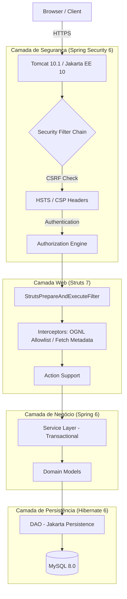
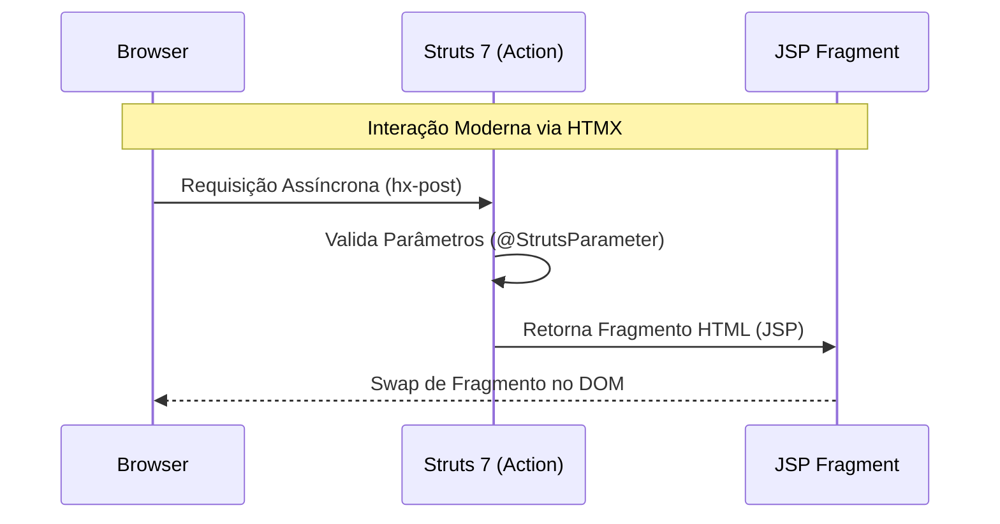

Documento de Visão Arquitetural: Modernização do Sistema Bolão (2026)

Este documento detalha a arquitetura técnica e a pilha tecnológica adotada na modernização do **Sistema Bolão**.

--------------------------------------------------------------------------------

1. Visão Geral da Arquitetura

A aplicação segue o padrão de **Monólito Modernizado**. 

A migração substituiu frameworks obsoletos (WebWork, Acegi, Hibernate 3) por versões de longo prazo (LTS) compatíveis com o ecossistema **Jakarta EE 10**.

Diagrama de Fluxo de Requisição

O diagrama abaixo ilustra como uma requisição percorre as camadas do sistema, destacando os pontos de interceptação de segurança e processamento:

--------------------------------------------------------------------------------

2. Detalhamento da Stack Tecnológica

2.1. Framework Web: Apache Struts 7.1.1

O Struts 7 foi a escolha estratégica para realizar o "transplante" do WebWork legado, permitindo o suporte nativo ao namespace `jakarta.*`.

• **Papel no Fluxo:** Atua como o controlador MVC, mapeando URLs `.action` para classes Java e gerenciando o ciclo de vida da interface baseada em JSP.

• **Papel na Segurança:**

    ◦ **Anotação** **@StrutsParameter****:** Bloqueia vetores de _Mass Assignment_ ao exigir autorização explícita para que parâmetros da requisição preencham atributos da Action.

    ◦ **OGNL Allowlisting:** Restringe o motor de expressões a pacotes de modelo autorizados, mitigando ataques de Execução Remota de Código (RCE).

2.2. Core e Injeção de Dependência: Spring Framework 6.1.14

O Spring 6 gerencia a inversão de controle (IoC) e as transações de negócio, desacoplando a lógica da infraestrutura web.

• **Papel no Fluxo:** Orquestra a injeção de serviços nas Actions e gerencia a demarcação transacional na camada de serviço.

• **Papel na Segurança:** Fornece a infraestrutura para segurança declarativa e integração robusta com o Spring Security.

2.3. Segurança: Spring Security 6.2.2

Substituiu o Acegi Security 1.0, eliminando vulnerabilidades de duas décadas e introduzindo proteções modernas.

• **Papel no Fluxo:** Intercepta todas as requisições antes que alcancem o Struts para validar a identidade e as permissões do usuário.

• **Papel na Segurança:**

    ◦ **BCrypt Hashing:** Substituiu o SHA-1 inseguro para armazenamento de senhas.

    ◦ **Proteção CSRF:** Utiliza o `CookieCsrfTokenRepository` para injetar tokens em formulários e requisições HTMX/Fetch.

    ◦ **HSTS e CSP:** Implementa cabeçalhos que forçam o uso de HTTPS e restringem a origem de scripts, prevenindo XSS e sequestro de sessão.

2.4. Persistência: Hibernate 6.4.4 (Jakarta Persistence)

A migração elevou a persistência para a API moderna do Jakarta Persistence, mantendo a compatibilidade com mapeamentos XML (HBM) legados.

• **Papel no Fluxo:** Mapeia objetos de domínio para tabelas MySQL, gerenciando o pool de conexões via HikariCP.

• **Papel na Segurança:** Prevenção nativa de SQL Injection através do uso obrigatório de queries parametrizadas (HQL/Criteria).

--------------------------------------------------------------------------------

3. Frontend Modernizado: A Arquitetura Híbrida

Em vez de uma reescrita total para SPA, adotamos uma abordagem de **Evolução Progressiva** utilizando HTMX para interações assíncronas e Vite para empacotamento de assets.

        Note over B: UI atualizada sem reload total

• **HTMX 1.9+:** Permite que o servidor retorne fragmentos de HTML que são injetados diretamente na tela, reduzindo em 90% a necessidade de JavaScript manual e eliminando o DWR inseguro.

• **Vite 5:** Gerencia o empacotamento de módulos JavaScript modernos, gerando manifestos com _hashing_ para controle de cache agressivo e segurança via CSP

4. Infraestrutura e Runtime: O Contêiner Seguro

A aplicação é executada em uma arquitetura de contêineres otimizada para segurança e reprodutibilidade.

• **Tomcat 10.1 (JDK 17):** Implementa o runtime Jakarta EE 10, obrigatório para os novos namespaces das bibliotecas.

• **Docker Multi-stage & Distroless:** O build ocorre em um estágio Maven e o artefato final é movido para uma imagem minimalista (sem shell ou utilitários desnecessários), reduzindo drasticamente a superfície de ataque em produção.
    graph LR
        subgraph "Docker Multi-Stage Build"
            Stage1[Stage 1: Maven Build] -->|sistema-bolao.war| Stage2[Stage 2: Runtime Distroless]
        end
        Stage2 -->|Deploy| Prod[Produção / Tomcat 10]
        Env[.env / Secrets] -.->|Injeção| Stage2

--------------------------------------------------------------------------------

5. Resumo da Postura de Segurança Post-Migração

| Ameaça                             | Tecnologia de Proteção                            | Status         |
| ---------------------------------- | ------------------------------------------------- | -------------- |
| **Interceptação (MITM)**           | HTTPS Mandatório via `web.xml` e HSTS             | ✅ Implementado |
| **Mass Assignment**                | Anotação `@StrutsParameter` no Struts 7           | ✅ Implementado |
| **RCE (Injeção OGNL)**             | OGNL Allowlisting e limites de expressão          | ✅ Implementado |
| **XSS**                            | CSP (Content Security Policy) e SanitizationUtils | ✅ Implementado |
| **CSRF**                           | CookieCsrfTokenRepository (Spring Security)       | ✅ Implementado |
| **Vulnerabilidade em Bibliotecas** | Monitoramento via OWASP Dependency-Check          | ✅ Monitorado   |

--------------------------------------------------------------------------------

Conclusão do Arquiteto

A nova stack do **Sistema Bolão** equilibra o reaproveitamento da lógica de negócio madura com o rigor técnico moderno. A transição para o namespace `jakarta.*`, aliada ao endurecimento proativo do Struts 7 e Spring Security 6, posiciona o sistema como uma plataforma robusta e segura para a Copa de 2026, eliminando 20 anos de débito técnico acumulado
