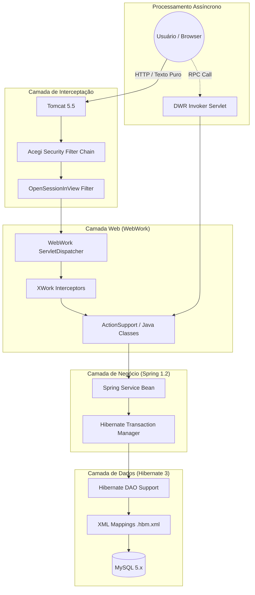
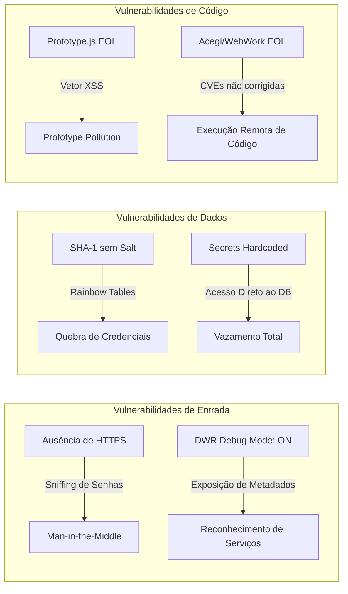

# Relatório de Arqueologia Tecnológica: O Legado do Sistema Bolão (Era 2006)

Este documento detalha a infraestrutura técnica original do **Sistema Bolão** antes do processo de modernização iniciado em 2026. Analisar este "museu tecnológico" é fundamental para compreender a dívida técnica acumulada e os riscos de segurança que tornaram a migração um imperativo de sobrevivência para o negócio.

--------------------------------------------------------------------------------

## 1. Visão Geral da Stack Legada (Ponto de Partida)

A aplicação operava sobre uma pilha tecnológica típica do início dos anos 2000, centrada no ecossistema **Java EE** da época. O sistema era um monólito clássico, com camadas rigidamente acopladas e configurações baseadas extensivamente em arquivos XML.

Mapa de Componentes Originais

• **Linguagem/Runtime:** Java 1.8 rodando em Tomcat 5.5.

• **Framework MVC:** WebWork 2.2.2 (baseado em XWork 1.1.3).

• **Injeção de Dependência/IoC:** Spring Framework 1.2.8.

• **Persistência (ORM):** Hibernate 3.2.6.ga.

• **Segurança:** Acegi Security 1.0.0.

• **Interface (Frontend):** JSPs, Prototype.js, Scriptaculous.js e Overlib.js.

• **Comunicação Assíncrona:** DWR (Direct Web Remoting) 2.0.1.

• **Build:** Ant (apenas para empacotamento, sem compilação automatizada).

--------------------------------------------------------------------------------

## 2. O Fluxo de Execução Legado

O diagrama abaixo ilustra como uma requisição de usuário era processada, atravessando a "floresta de XMLs" e as camadas sobrecarregadas do sistema:

Papel de Cada Tecnologia no Fluxo:

1. **Acegi Security:** O antecessor do Spring Security gerenciava a autenticação via `JdbcDaoImpl`. Ele era responsável por interceptar URLs e aplicar regras de permissão (roles) definidas em um XML verboso.

2. **WebWork/XWork:** Atuava como o controlador MVC. As requisições `.action` eram mapeadas no `xwork.xml`, onde o XWork gerenciava interceptores e enviava os dados para as Actions Java.

3. **Spring 1.2.8:** Servia como o "colante" do sistema, realizando a injeção de dependência via XML. Gerenciava o ciclo de vida dos beans de serviço e a transacionalidade.

4. **Hibernate 3:** Transformava as linhas do MySQL em objetos Java usando mapeamentos em arquivos `.hbm.xml`. A gestão de sessões era feita pelo `OpenSessionInViewFilter`, que mantinha conexões abertas durante toda a renderização da página.

5. **DWR (Direct Web Remoting):** Permitia que o JavaScript no browser chamasse métodos Java diretamente no servidor. Era usado principalmente para funcionalidades como o chat e atualizações de palpites em tempo real.

--------------------------------------------------------------------------------

## 3. Análise de Vulnerabilidades e Riscos Críticos

A stack original era um passivo de segurança incalculável, apresentando falhas que expunham o sistema a ataques triviais.

O Labirinto de Insegurança

Detalhamento dos Riscos:

| Tecnologia         | Vulnerabilidade Identificada                                                           | Impacto no Negócio                                                                                                |
| ------------------ | -------------------------------------------------------------------------------------- | ----------------------------------------------------------------------------------------------------------------- |
| **Protocolo HTTP** | Ausência de HTTPS obrigatório.                                                         | Credenciais de login transmitidas em texto claro, facilitando o sequestro de contas.                              |
| **Criptografia**   | Hashing via SHA-1 sem salt.                                                            | Vulnerável a ataques de força bruta e colisões; se o banco vazasse, todas as senhas seriam revertidas em minutos. |
| **Configuração**   | Credenciais de banco _hardcoded_ em arquivos XML (`applicationContext-resources.xml`). | Qualquer pessoa com acesso ao código ou backup tinha controle total sobre os dados da Copa.                       |
| **DWR 2.x**        | Modo debug ativo em produção e superfície RPC exposta.                                 | Vazamento de detalhes internos da arquitetura e risco de chamadas RPC maliciosas.                                 |
| **Frameworks EOL** | Acegi 1.0.0 e WebWork 2.2.2 sem patches há ~20 anos.                                   | Existência de múltiplas CVEs conhecidas que permitem bypass de autenticação e execução de código.                 |
| **Frontend**       | Prototype.js e Scriptaculous (vulnerabilidades XSS).                                   | Risco de injeção de scripts maliciosos que poderiam roubar sessões de administradores.                            |

--------------------------------------------------------------------------------

## 4. Conclusão do Arquiteto

O estado pré-migração do Sistema Bolão não era apenas obsoleto; era tecnicamente insustentável: 

- A dependência de um build frágil via Ant, que não garantia a sincronização entre código e bytecode, somada à exposição de segredos no repositório, criava um cenário onde um incidente de segurança não era uma questão de "se", mas de "quando".

A decisão de remover o chat baseado em DWR e desativar o modo debug foram as primeiras medidas de "estancamento de sangramento" para proteger a integridade dos dados antes do transplante completo para a stack moderna de 2026.

