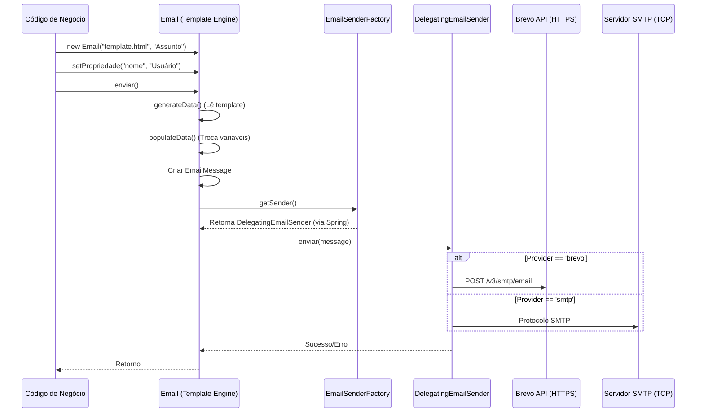
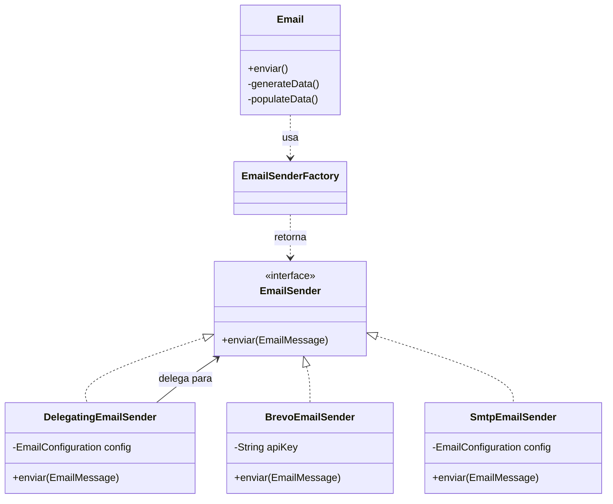

# Arquitetura do Sistema de E-mail

Este documento descreve o funcionamento do módulo de e-mail do Sistema Bolão, detalhando o fluxo de envio e a integração com provedores (SMTP e Brevo).

## Visão Geral

O sistema utiliza um padrão de **Estratégia (Strategy)** para permitir a alternância entre diferentes mecanismos de transporte de e-mail sem alterar o código de negócio. Isso é fundamental para suportar ambientes com restrições de rede, como o Hugging Face Spaces.

### Componentes Principais

1.  **`Email.java`**: Fachada de alto nível usada pelo sistema. Responsável por carregar templates HTML e realizar a substituição de variáveis.
2.  **`EmailMessage`**: Objeto de transferência de dados (DTO) que contém os dados brutos da mensagem processada.
3.  **`EmailSender` (Interface)**: Define o contrato de envio (`enviar(EmailMessage)`).
4.  **`BrevoEmailSender`**: Implementação que utiliza a API REST v3 da Brevo via HTTPS (Porta 443).
5.  **`SmtpEmailSender`**: Implementação legada que utiliza o protocolo SMTP (Portas 465/587).
6.  **`DelegatingEmailSender`**: Componente que decide em tempo de execução qual provedor usar baseado na variável `EMAIL_PROVIDER`.

## Fluxo de Envio

O diagrama abaixo ilustra o caminho percorrido desde a solicitação de envio até a entrega final:

## Configurações e Provedores

### 1. Brevo REST API (Recomendado para Cloud)
Utiliza chamadas HTTP seguras. Ideal para ambientes onde as portas SMTP convencionais estão bloqueadas.
- **Protocolo**: HTTPS (Porta 443)
- **Autenticação**: Header `api-key` (Secret `CHAVE_API_BREVO`)
- **Vantagens**: Alta entregabilidade, não bloqueado por firewalls de rede comuns.

### 2. SMTP (Legado / Local)
Utiliza bibliotecas Jakarta Mail tradicionais.
- **Protocolo**: SMTP/S (Portas 465 ou 587)
- **Autenticação**: Usuário e Senha (Variables `SMTP_USERNAME`, `SMTP_PASSWORD`)
- **Vantagens**: Compatível com qualquer servidor de e-mail tradicional (Gmail, Outlook).

### Variáveis de Ambiente Relevantes

| Variável | Descrição | Valores Possíveis |
| :--- | :--- | :--- |
| `EMAIL_PROVIDER` | Define o motor de envio | `brevo`, `smtp` |
| `CHAVE_API_BREVO`| Chave da API do Brevo | (Token de API) |
| `SMTP_FROM_ADDRESS`| Endereço de e-mail do remetente | ex: `bolao@meudominio.com` |
| `SMTP_FROM_NAME` | Nome que aparece no remetente | ex: `Bolão da Copa` |

## Diagrama de Classes

## FAQ / Dúvidas Frequentes

### 1. Preciso configurar a variável `EMAIL_PROVIDER` no Hugging Face?
**Sim.** Você deve configurar a variável de ambiente `EMAIL_PROVIDER` com o valor `brevo` nas configurações do seu Space. Caso contrário, o sistema tentará o envio via SMTP (valor padrão), que é bloqueado pelo Hugging Face.

### 2. O e-mail ainda passa pelo SMTP do Google/Gmail?
**Não.** Quando `EMAIL_PROVIDER=brevo` está ativo, o sistema envia os dados do e-mail diretamente para os servidores da Brevo via **API REST (HTTPS)**. Todo o processo de entrega para o destinatário final é feito pela infraestrutura da Brevo, ignorando completamente qualquer configuração de SMTP do Google ou de outros provedores que tenham sido configuradas anteriormente.

### 3. Posso apagar as variáveis `SMTP_HOST`, `SMTP_PORT`, etc?
Embora o sistema ignore essas variáveis quando o `brevo` está ativo, recomendamos mantê-las (ou manter o exemplo documentado) caso queira alternar rapidamente de volta para SMTP em outro ambiente. O que define qual será usado é exclusivamente a variável `EMAIL_PROVIDER`.

## Como Validar um Remetente (Sender) no Brevo

Para que o envio funcione, o e-mail definido em `SMTP_FROM_ADDRESS` deve ser validado no painel do Brevo. Caso contrário, você receberá um erro `403 Forbidden` ou `400 Bad Request`.

1.  Acesse o painel do [Brevo](https://app.brevo.com/).
2.  No menu superior direito, clique no **nome da sua conta/empresa**.
3.  Selecione **"Senders, Domains & Dedicated IPs"**.
4.  Clique na aba **"Senders"**.
5.  Clique no botão **"Add a sender"**.
6.  Preencha o **Nome** (ex: `Bolão da Copa`) e o **E-mail** (ex: `contato@seu-dominio.com`).
7.  Aguarde o e-mail de confirmação da Brevo e clique no link de validação.

## Checklist de Configuração (Hugging Face)

Certifique-se de que as seguintes chaves existam no seu Space:

- [ ] **`EMAIL_PROVIDER`** (Variable): `brevo`
- [ ] **`CHAVE_API_BREVO`** (Secret): Sua chave v3 do Brevo.
- [ ] **`SMTP_FROM_ADDRESS`** (Variable): E-mail validado no passo acima.
- [ ] **`SMTP_FROM_NAME`** (Variable): Nome de exibição do sistema.
- [ ] **`SMTP_SYSTEM_URL`** (Variable): URL do seu Space (com `https://`).
- [ ] **`SMTP_ADMIN_EMAILS`** (Variable): E-mail(s) para receber notificações de novos participantes.
