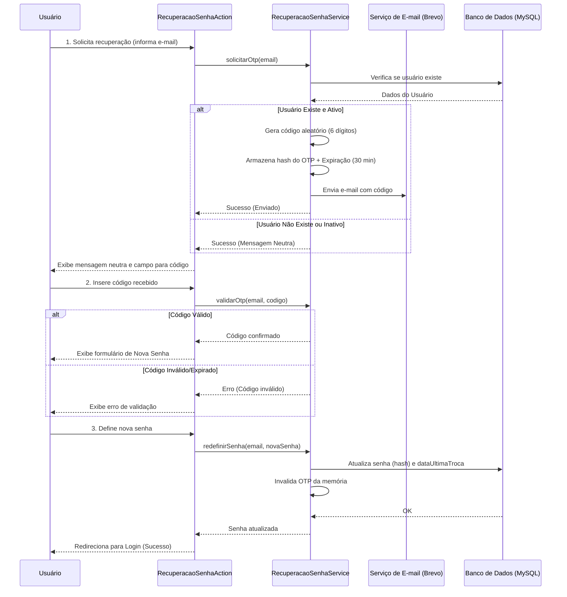

# Fluxo de Recuperação de Senha (OTP)

Este documento detalha o processo de recuperação de senha do sistema Bolão, implementado com base na [ADR-007](../adr/007-recuperacao-senha-otp-memoria.md).

## Visão Geral

O sistema utiliza um modelo de **OTP (One-Time Password)** numérico enviado por e-mail. Este fluxo foi projetado para ser seguro, resiliente a ataques de enumeração e simples de manter, utilizando armazenamento em memória volátil para os códigos temporários.

## Diagrama do Fluxo

## Detalhes Técnicos

### 1. Segurança e Privacidade
*   **Mensagens Neutras:** Para evitar a enumeração de usuários, o sistema sempre informa que "um e-mail foi enviado caso o endereço conste em nossa base", mesmo que o e-mail não exista.
*   **Proteção Brute-Force:** O `RecuperacaoSenhaService` implementa um limite de tentativas de validação. Após sucessivos erros, o OTP é invalidado.
*   **Sanitização:** Todos os inputs (e-mail, código, senha) passam por filtros de limpeza para evitar injeção de HTML ou scripts (XSS).

### 2. Ciclo de Vida do OTP
*   **Validade:** 30 minutos a partir da geração.
*   **Uso Único:** Uma vez que a senha é alterada com sucesso, o código é imediatamente removido da memória.
*   **Volatilidade:** Os códigos são mantidos em cache local (memória RAM). Em caso de restart do servidor, os usuários precisarão solicitar um novo código (decisão de design para evitar complexidade de tabelas transientes).

### 3. Persistência no Banco de Dados
Embora o token seja em memória, o sistema registra permanentemente no banco:
*   A nova senha (criptografada).
*   O campo `dataUltimaTrocaSenha` na tabela de participantes, permitindo auditoria básica.

## Componentes Envolvidos

| Camada | Componente | Responsabilidade |
| :--- | :--- | :--- |
| **Apresentação** | `RecuperacaoSenhaAction` | Orquestra as requisições HTTP e navegação entre telas. |
| **Negócio** | `RecuperacaoSenhaService` | Gera OTP, valida regras de expiração e limites de tentativas. |
| **Infraestrutura** | `EmailService` | Interface de envio para a API do Brevo. |
| **Modelo** | `Participante` | Entidade que armazena a senha e metadados de acesso. |

---
*Documentação gerada em 04/06/2026.*
